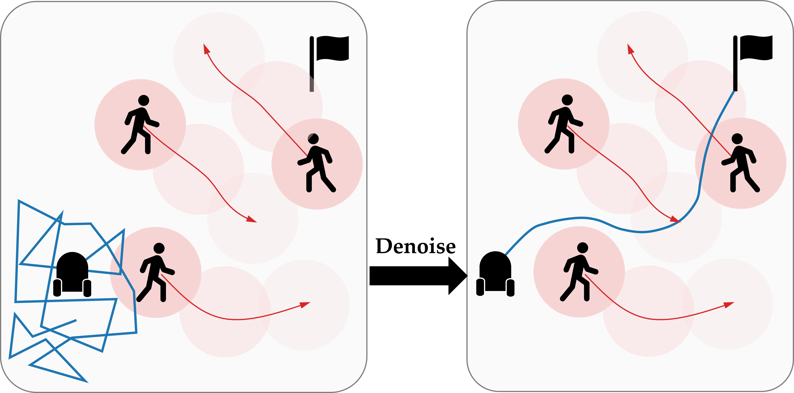

# CoBL-Diffusion: Diffusion-Based Conditional Robot Planning in Dynamic Environments Using Control Barrier and Lyapunov Functions

[[Project page]](https://m-kazuki.github.io/cobl_diffusion_website/)
[[Paper]](https://ieeexplore.ieee.org/document/10802549)

[Kazuki Mizuta](https://m-kazuki.github.io/)<sup>1</sup>,
[Karen Leung](https://faculty.washington.edu/kymleung/)<sup>1,2</sup>

<sup>1</sup>University of Washington,
<sup>2</sup>NVIDIA



## Installation

```
pip install -e . 
```

## Usage

Train a diffusion model for the robot navigation with:
```
python scripts/train.py
```

Sample code for CoBL-Diffusion is in [`notebooks/cobl.ipynb`](notebooks/cobl.ipynb).

## Dataset and Pretrained File
To use the notebooks above, please download the necessary files from [Google Drive](https://drive.google.com/drive/folders/1YYxMKDK8gWtZCOWNdiOHskAxEIpNUpvX?usp=sharing) and place them in the specified directories:

- `eval80_ego.pt` → `/dataset`
- `eval80_obs.pt` → `/dataset`
- `train80.pt` → `/dataset`
- `cobl.pt` → `/trained_model`


## Reference
```
@inproceedings{MizutaLeung2024,
  title = {CoBL-Diffusion: Diffusion-Based Conditional Robot Planning in Dynamic Environments Using Control Barrier and Lyapunov Functions},
  author = {Kazuki Mizuta and Karen Leung},
  booktitle = {IEEE/RSJ International Conference on Intelligent Robots and Systems},
  year = {2024},
}
```


## Acknowledgements

This repository is based on the following repo:
  - [latent-diffusion](https://github.com/CompVis/latent-diffusion/tree/main) repo
  - [diffuser](https://github.com/jannerm/diffuser/tree/maze2d) repo
  - [trajdata](https://github.com/NVlabs/trajdata/tree/main) repo